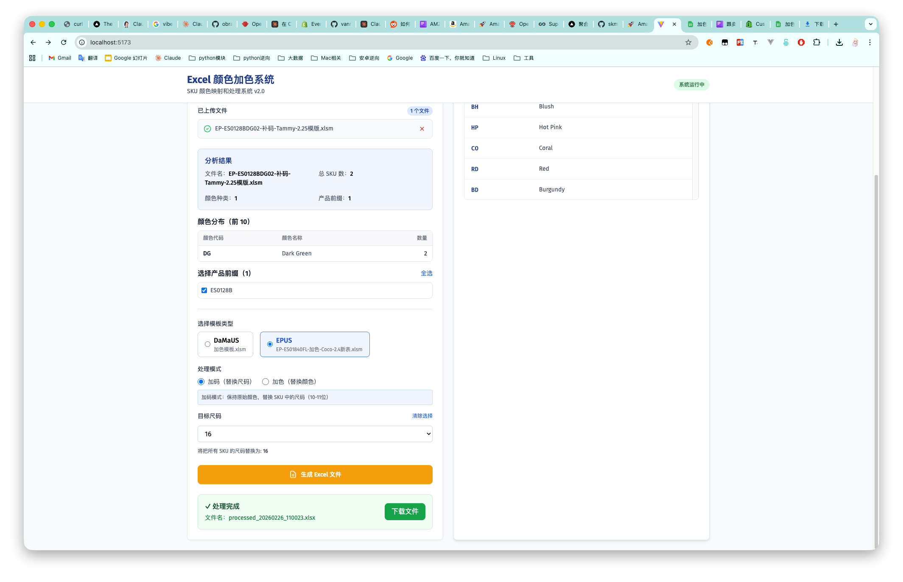

# BU2Ama 项目重构工作总结

**日期：** 2026年2月26日

## 项目概述

BU2Ama 是一个 Excel 颜色加色系统，用于处理电商 SKU 数据的颜色编码映射和批量加色处理。

## 今日工作内容

### 1. 架构重构：从 Node.js 迁移到 Python + React

完成了项目的全面技术栈升级，将原有的 Node.js 单体应用重构为现代化的前后端分离架构：

**后端重构（Python + FastAPI）**
- 采用 FastAPI 框架构建高性能异步 API 服务
- 使用 openpyxl 库重写 Excel 文件处理逻辑
- 引入 Pydantic 进行数据验证和序列化
- 实现了清晰的分层架构：
  - `app/api/` - API 路由层
  - `app/core/` - 核心业务逻辑
  - `app/models/` - 数据模型定义
  - `app/config.py` - 配置管理

**前端重构（React + TypeScript）**
- 使用 React 18 + TypeScript 构建类型安全的用户界面
- 采用 Vite 作为构建工具，提升开发体验
- 集成 Tailwind CSS 实现现代化 UI 设计
- 引入 React Query 管理服务端状态
- 使用 Zustand 处理客户端状态管理
- 组件化设计：
  - `ColorMapping/` - 颜色映射管理
  - `ExcelUpload/` - 文件上传与分析
  - `ExcelProcess/` - Excel 处理流程

### 2. 核心业务逻辑优化

**加色逻辑处理**
- 实现了智能的 SKU 解析算法，支持格式：`产品码(7-8位) + 颜色码(2位) + 尺码(2位) + 后缀(可选)`
- 优化颜色映射系统，支持批量导入和实时搜索
- 实现了颜色分类功能，将颜色名称归类到标准色系（紫、蓝、绿、红、粉、橙、黄、棕、黑、白、灰、多色）

**加码逻辑处理**
- 支持多文件批量上传和分析
- 实现了按后缀分组的多 Sheet 输出功能
- 自动生成产品图片 URL（支持 DaMaUS 和 EPUS 两种模板格式）
- 智能计算上架日期（基于北京时间 UTC+8，下午3点为分界点）

### 3. 模板系统增强

- 支持两种 Excel 模板：
  - `加色模板.xlsm` - DaMaUS 模板（使用 `-PL10.jpg` 图片格式）
  - `EP-ES01840FL-加色-Coco-2.4新表.xlsm` - EPUS 模板（使用 `-L1.jpg` 图片格式）
- 实现了灵活的列配置系统，支持不同模板的字段映射
- 优化了多 Sheet 生成逻辑，每个后缀独立成表

### 4. 数据流程优化

完整的数据处理流程：
1. **上传** - 用户上传包含 SKU 数据的 Excel 文件
2. **分析** - 系统解析 SKU，识别颜色编码，统计数据分布
3. **处理** - 用户选择产品前缀过滤，系统基于模板生成新 Excel
4. **下载** - 用户下载带有颜色映射的完整 Excel 文件

### 5. 开发体验提升

- 配置 Docker Compose 实现一键启动
- 完善 API 文档（FastAPI 自动生成 Swagger 文档）
- 编写详细的 CLAUDE.md 项目文档
- 保留原 Node.js 版本到 `legacy/` 目录作为参考

## 技术亮点

1. **类型安全**：前端 TypeScript + 后端 Pydantic 实现全栈类型检查
2. **异步处理**：FastAPI 异步特性提升文件处理性能
3. **状态管理**：React Query + Zustand 实现高效的状态同步
4. **模块化设计**：清晰的分层架构，易于维护和扩展
5. **容器化部署**：Docker Compose 简化部署流程

## 项目成果

- ✅ 完成从 Node.js 到 Python + React 的完整重构
- ✅ 优化加色和加码核心业务逻辑
- ✅ 实现现代化的前后端分离架构
- ✅ 提升代码可维护性和扩展性
- ✅ 改善用户体验和系统性能

**技术栈：** Python (FastAPI) + React (TypeScript) + Docker
**核心功能：** SKU 颜色映射 + Excel 批量加色处理
